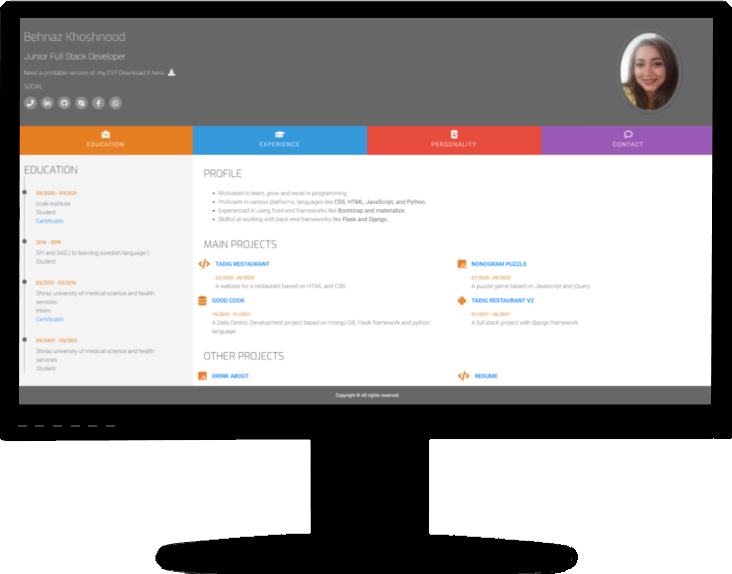
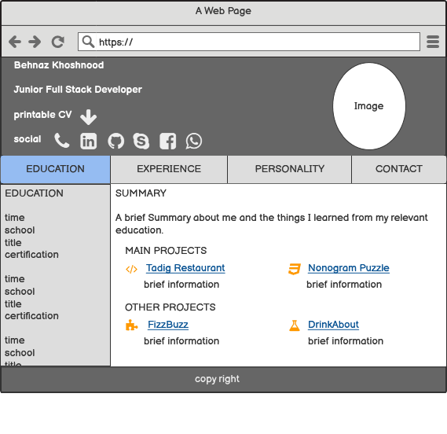
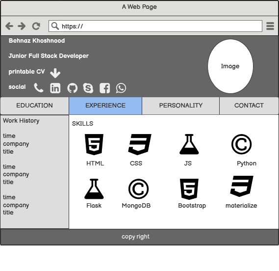
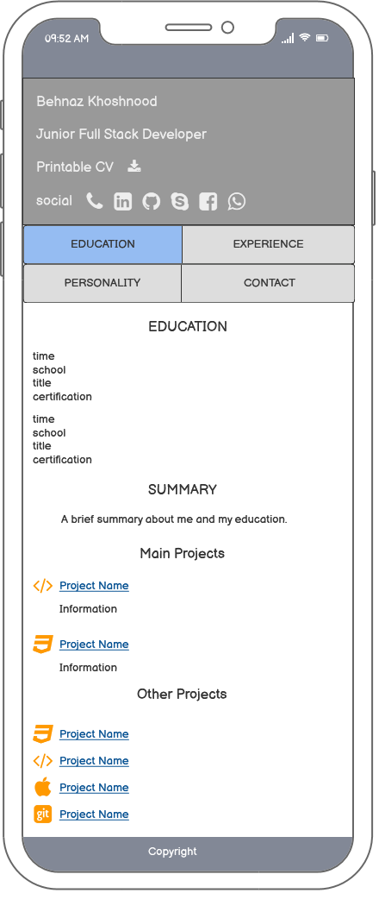
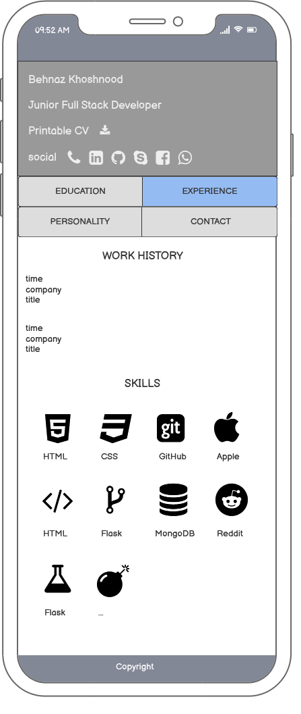
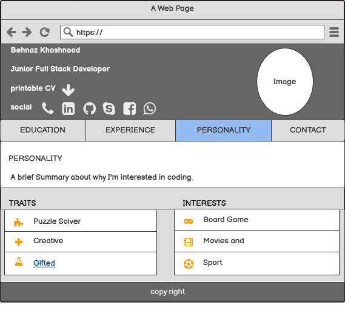
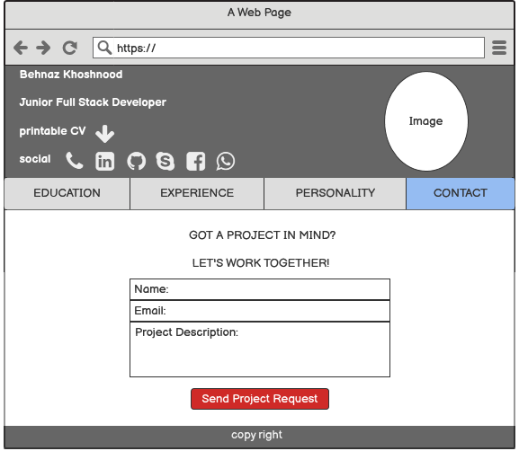
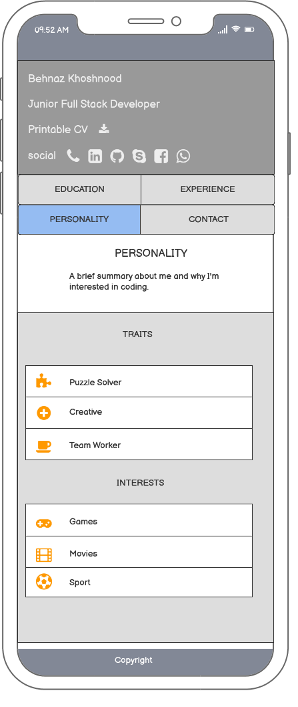
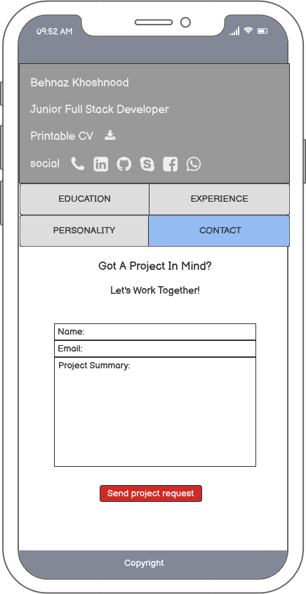

# <center>**Behnaz Khoshnood Resume**

[View the live project here.](https://behnazkhoshnood.github.io/resume/)

This website is a resume for Behnaz Khoshnood. It contains all the information that is relevant for hiring managers or potential customers.



---
## **Contents** ##
* UX
    * [Project Summary](#project-summary)
    * [User Stories](#user-stories)
    * [Design Choices](#design-choices)
* [Wireframes](#wireframes)
* [Features](#features)

* [Technologies](#technologies)
* [Testing](#testing)
* [Fixed Issues](#fixed-issues)
* [Deployment](#deployment)
* [Credit](#credits)
---
## **UX (User Experience)** ##

### **Project Summary** ###

The purpose of this project is to summarise all my academic, professional, and personal achievements to entice or interest a hiring manager when applying for a new job opportunity.

### **User Stories**

#### **As a hiring manager**

- **Registration and User Account**

  - I want to be able to navigate through the site easily.

  - I want to be able to see all the relevant information about the hiring candidate; as a summary, work and education history, skills, projects, and personality.
  - I want to be able to see the candidate's contact and social information.
  - I want to have access to a printable version of the CV.
  - I want to be able to contact the candidate through email or phone number.

#### **As a resume Owner**

  - I want to be able to showcase some of my coding abilities via this resume.

### **Design choices**

  The goal in design was to create a website that is overall user friendly, has a modern feel with emphasis on providing information about the resume Owner.

- **Framework**
  * Front-end framework
I chose [Bootstrap](https://Bootstrap.com/) framework for this project for its modern interface and ease of use.
  
  * For a nice Hover to bottom effect, I used [Hover](http://ianlunn.github.io/Hover/).

  * [JQuery](https://jquery.com/) was used for initializing some bootstrap elements.

- **Typography**

  - I used [Google Fonts](https://fonts.googleapis.com/css?family=Roboto:100,200,300,400,500,600,700|Exo:100,200,300,400,500,600,700) for the font style of my project:
    - The font I have used for the body of this project is called **Roboto** and sans-serif as a backup font.

    - The font I have used for headings of this project is called **Exo** and sans-serif as a backup font.

- **Icons**

  - I used [Favicon](https://flask.palletsprojects.com/en/1.1.x/patterns/favicon/) to make a unique brand for my website.

  - I used [FontAwesome](https://fontawesome.com/) as the main icon library across the project.

- **Colour Scheme**

  To make the navbar easily detectable, I used four bright colors. 

  - **Main color palette**

    - **header information and footer**

        - For the background color, a dark shade of gray color is used:  #676767
        - For the font color, white color is used: #ffffff

    - **Navbar**

      - For **EDUCATION**, a shade of orange color is used : #e67e22

      - For **EXPERIENCE**, a shade of blue color is used : #3498db
      - For **PERSONALITY**, a shade of red color is used : #e74c3c
      - For **CONTACT**, a shade of purple color is used : #9b59b6

    -**Main Section**

      - For the side column, a light shade of gray is used: #f4f4f4
      - For timelines and icons, the bright orange color is used: #3498db
      - For body font color, a dark shade of gray is used: #555555
      - For the main column background, white color is used: #ffffff
---
## **Wireframes**

[Balsamiq Wireframes](https://balsamiq.com/wireframes/) was used to create all wireframes for the project.

 ### **Education and Experience Desktop views** ###


<center>Education | <center>Experience
- | -
 | 

 ### **Education and Experience mobile views** ###

<center>Education | <center>Experience
- | -
 | 

 ### **Personality and Contact desktop views** ###

<center>Personality | <center>Contact
- | -
 | 

 ### **Personality and Contact mobile views** ###

<center>Personality | <center>Contact
- | -
 | 
---

## **Features**

- **Implemented features**

  - **Common features in all pages**

    - All of the pages contain a 3 part layout with the Header, Main part of the page, and the Footer.

        - **Header**

            - Key information like name, title, photo, printable cv, and social contacts are in the header part of all pages.

            - Main navbar is dividing the information into Education, Experience, Personality, and Contact.
           - In tablet and desktop screens, the main navbar is fixed on top of the page and is lined up in one line. On smaller screens, this navbar turns to two lines.

        - **The Footer**

            The footer contains copyright at the bottom of all pages.

  - **Education Page**

    - This page contains the education history, a summary, education history, and projects.

    - In desktop views, education history is placed at the 1/3 left part of the page, and summary and project occupy the rest 2/3.
    - In mobile views, education history, summary, and projects are placed under each other.

  - **Experience Page**

    - This page contains the work history and skills.

    - In desktop view, work history takes 1/3 of the screen from the left side; and skills takes the rest of the page.
    - In tablet views,  this ratio changes to 1/2.
    - In mobile views, work history and skills are placed under each other.

  - **Personality Page**

    - This page contains a summary, traits, and interests.

    - In desktop views, the summary is at the top of the page, and traits and interests are, side by side, under the summary.
    - In mobile views, all the information is in one column.

  - **Contact Page**

    - To contact the CV owner, a contact form is provided for the potential customers or hiring managers.

- **Features Left to Implement**
   - Make a better version with Django frameworks to wire all common parts of the pages in a base page.

   - Add a cover letter for a targeted hiring manager.
---

## **Technologies**

- **Front and Back end Technologies**

  - [HTML5](https://validator.w3.org/) is used to put the page structure in place.

  - [DevTools](https://developer.chrome.com/docs/devtools/) is used for ressponssive design.
  - [Google fonts](https://fonts.google.com/) is used for the site fonts.
  - [CSS](https://www.w3.org/Style/CSS/Overview.en.html) is used to style and allign images and other structures on the page.en.html).
  - [Font awesome](https://fontawesome.com/) is used for its icons.
  - [Bootstrap](https://getbootstrap.com/) is used for page layout.
  - [Hover](http://ianlunn.github.io/Hover/) is used to give a nice hover to bottom effect to the menu items.
  - [EmailJs](https://www.emailjs.com/docs/) is used for the contact form functionality.
  - [JavaScript](https://www.ecma-international.org/) is used for interactivity.

- **Deployment**

    - [GitHub](https://github.com/)is used to make this repository, for version control of the project, and; to host this application.
    - [Gitpod](https://www.gitpod.io/)'s development workspace used to write the code for this project.

- **validators**

  - The validators that have been used on the project are as followed:
    - [HTML Validator](https://validator.w3.org/nu/) - No issues
    - [CSS Validator](https://jigsaw.w3.org/css-validator/) - No issues
    - [Javascript Validator](https://jshint.com/) - No issues

- **User stories tests**

- **Testing user experience:**

  - All links are attached to their score, and all the buttons work without any issue.
---
## **Testing**
- **Supported browsers and screens**

  - The Website works on Google Chrome, Microsoft Edge, and Firefox, and Opera browsers.

  - The website is responsive on a variety of emulated devices such as iphone4, 5, SE, 6, 6 plus, 7, 7plus, 8, 8plus and X, Nokia Lumia 520 and N9, Moto G4, Galaxy S5, Blackberry Z30, and playbook, Galaxy note, Microsoft Lumia 950 and 550, LG Optimus L70, Nexus 4, 5, 6, 7 and 10, 6P, Pixel 2 and 2XL, iPad mini, iPad, Kindle Fire, iPad pro and laptop with MDPI, touch, and HiDPI.
---
## **Fixed Issues**

- **Issue 1** 

  - There was an issue with the footer placement in different views.
    - I used the code below  to fix the footer placement for shorter views:

    ```
      footer {
         height: 55px;
         margin-top: -55px;
      }
    ```
       - I used the code below to fix the footer placement in higher heights views:

    ```
    @media(min-height:949px){
      footer{
        position:fixed;
        bottom:0;
        width:100%;
        height:60px;
      }
    }
    ```

- **Issue 2**

  - The photo placement was wrong in tablet views.
    - To fix the photo position in the middle of the top right div in tablet and desktop views, I used this code:

    ```
    @media(max-width: 601px){
    .photo{
        display: none;
      }
    }
    ```

- **Issue 3**

  - Some of the Images when blurry.
  - I fixed this issue by using this code to my image CSS:

        image-rendering: -webkit-optimize-contrast;

---

## Deployment

  1. Go to Behnaz Khoshnood repository page in GitHub and choose [behnazkhoshnood/resume](https://github.com/behnazkhoshnood/resume).

  2. Go to [settings](https://github.com/behnazkhoshnood/resume/settings). In GitHub pages.
  3. Connect to this GitHub repository.
  4. Configure the deploy options.
  5. Deploy your project.

---

## **Credits**

- All the images for the skills are provided form the sorces below:

[HTML icon image](https://icons-for-free.com/iconfiles/png/512/html+html5+icon-1320186681398289636.png)

[CSS icon image](http://cdn.onlinewebfonts.com/svg/img_565439.png)

[JS icon image](https://img.icons8.com/ios-filled/452/javascript-logo.png)

[Python icon image](https://img.icons8.com/metro/452/python.png)

[Github icon image](https://encrypted-tbn0.gstatic.com/images?q=tbn:ANd9GcTT4NPUshn7uRYgSRvTfUYqP5tUcG9r1uRtgATZqPijoo7T1N5CIJ-yEoICT9nNabcmF2I&usqp=CAU)

[MongoDB icon image](https://encrypted-tbn0.gstatic.com/images?q=tbn:ANd9GcRV_sYQlmT6Kr_g2kqLEmBBykurCf_EHRD5JjeXAiLpkUIIT_CCP_7VKqbj2toY7l8qOHA&usqp=CAU)

[Flask icon image](https://banner2.cleanpng.com/20180508/qyw/kisspng-flask-python-web-framework-web-application-tutoria-5af1dbb70b6430.1030595115257998630467.jpg)

[Heroku icon image](https://banner2.cleanpng.com/20180531/lbf/kisspng-heroku-computer-icons-computer-servers-catalog-ser-24-5b103ecbd98262.9829309615277913078909.jpg)

[Django icon image](https://pbs.twimg.com/profile_images/752207108750340096/CicamXxN_400x400.jpg)

- **Resources**

  Below is a list of the resources used to create this project:

  - [Stack Overflow](https://stackoverflow.com/)
  - [w3schools](https://www.w3schools.com/)

### **Acknowledgements**

 - Big thanks to the code institute group for all their support.